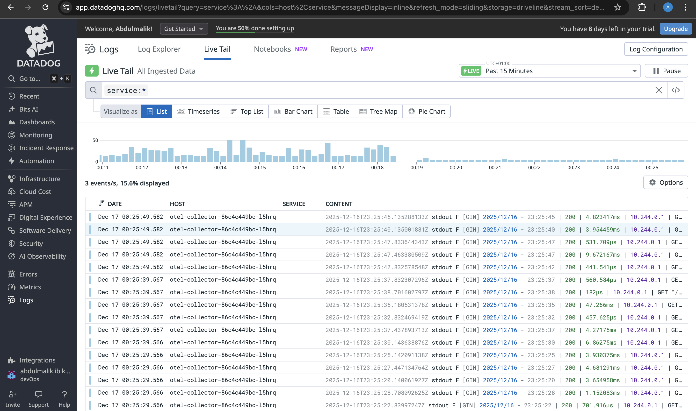

# OpenTelemetry → Datadog Logs

## Purpose
Collect application logs via OpenTelemetry and send them to Datadog alongside traces and metrics.

---

## Configuration Summary

### Log Pipeline
```yaml
logs:
  receivers: [filelog]
  processors: [batch, resource]
  exporters: [datadog/exporter, debug]
````

### Filelog Receiver

```yaml
filelog:
  include:
    - /var/log/pods/*government-api*/*/*.log
    - /var/log/pods/*loan-validator-portal*/*/*.log
  exclude:
    - /var/log/pods/*/otel-collector/*.log
  start_at: end
  include_file_path: true
  include_file_name: false
```

---

## Verification

### 1. Datadog Logs Explorer

* Navigate to **Logs → Explorer**


  ```
  service:government-api OR service:loan-validator-portal
  ```



---

### 2. OpenTelemetry Collector Debug

Check logs from the collector:

```bash
kubectl logs <otel-collector-pod>
```

---

## Result

* Logs collected from selected pods
* Logs enriched with Kubernetes metadata
* Logs exported and visible in Datadog Logs dashboard

